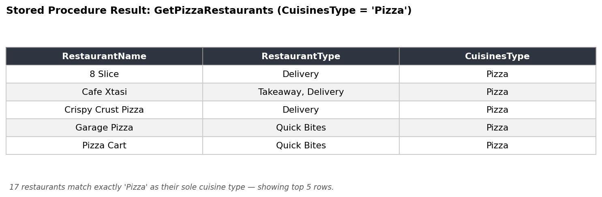
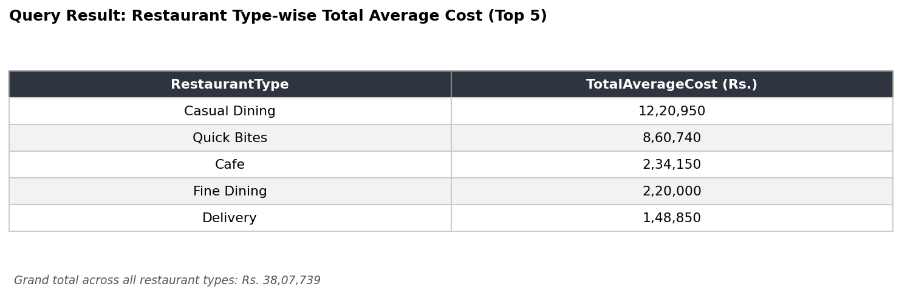
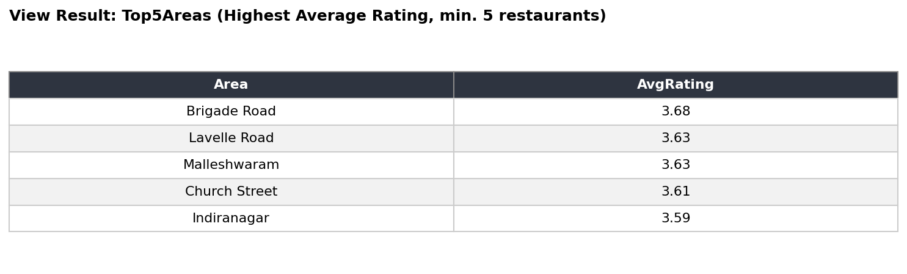

# SQL Relational Database Design & Analysis

## Overview
A collection of SQL projects demonstrating relational database design and query writing — progressing from schema design and basic querying to advanced database programming (functions, stored procedures, transactions, and views).

## Tools Used
- SQL Server (T-SQL)
- MySQL

## What's Inside

| File | Description |
|---|---|
| `01_schema_design_salesman_customer_orders.sql` | Designed a relational database from scratch (Salesman, Customer, Orders tables) with primary keys, foreign keys, and constraints. Includes multi-table JOIN queries for business reporting. |
| `02_employee_case_study_queries.sql` | A four-table Employee/Department/Job/Location schema used to demonstrate the full range of SQL querying — WHERE filters, ORDER BY, GROUP BY/HAVING, JOINs, CASE statements, and subqueries. |
| `03_advanced_functions_and_case_statements.sql` | User-defined functions, CASE-based categorization, and built-in math/date functions applied to a restaurant listings dataset. |
| `04_stored_procedures_transactions_views.sql` | Stored procedures, transaction control (COMMIT/ROLLBACK), window functions (ROW_NUMBER), views, loops, and triggers. |

## Key Skills Demonstrated
- Relational database design with primary keys, foreign keys, and constraints
- Multi-table JOINs (INNER, RIGHT) for cross-table business insights
- Aggregations, GROUP BY/HAVING, and subqueries for data analysis
- Stored procedures and user-defined functions
- Transaction control and rollback handling
- Window functions and views for reporting

## Dataset
Files 03 and 04 use a restaurant listings dataset (`data/Jomato.csv`) containing 7,100+ records with fields like restaurant name, type, rating, cuisine, cost, and location — used to practice functions, procedures, and transactions on a realistic, messy real-world dataset.

## Sample Output

**Stored Procedure — Restaurants serving Pizza:**

**Restaurant Rating Status Distribution:**

**Restaurant Type-wise Total Average Cost:**

**View — Top 5 Areas by Average Rating:**

**User-Defined Function Demo:**

**Salesman-Customer-Orders JOIN:**

**Department-wise Salary Summary:**

**Employee-Department JOIN:**

## How to Run
1. Set up SQL Server (or MySQL, with minor syntax adjustments)
2. For files 03 and 04, import `data/Jomato.csv` into a table named `Jomato`
3. Run the schema/table creation statements in each file
4. Execute the queries in order to reproduce the analysis
